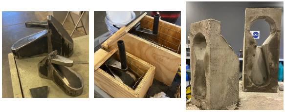
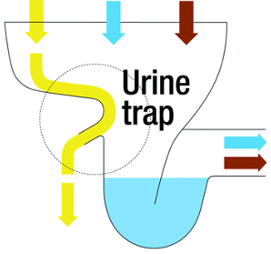
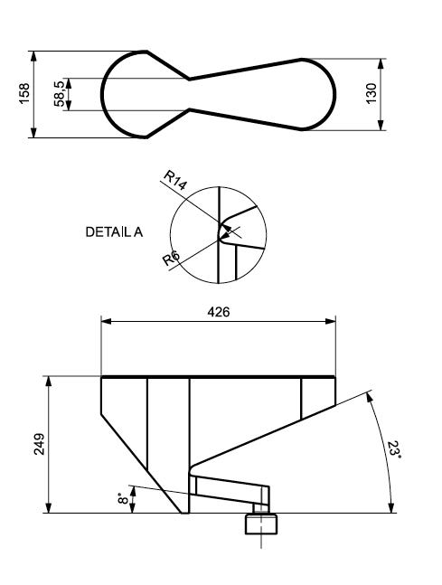
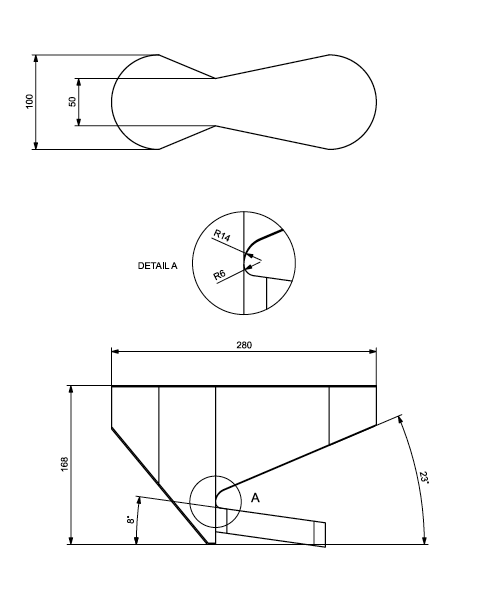
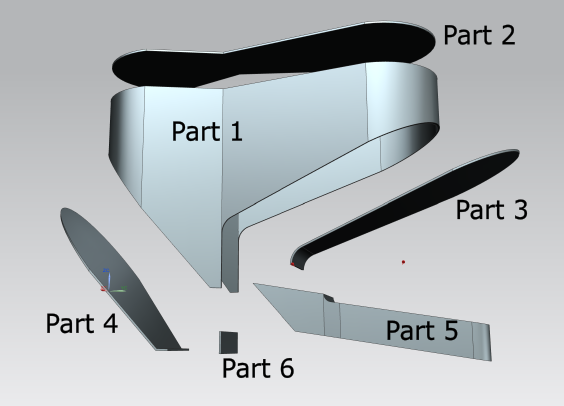
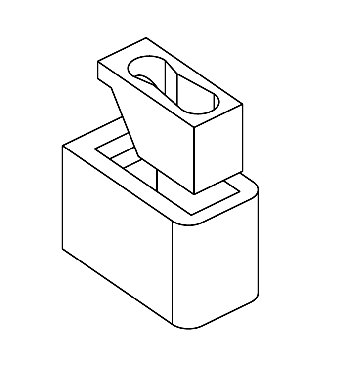
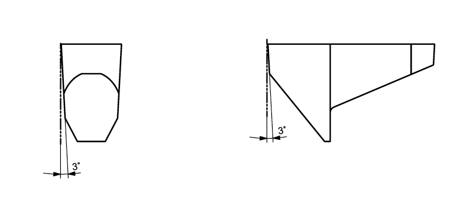
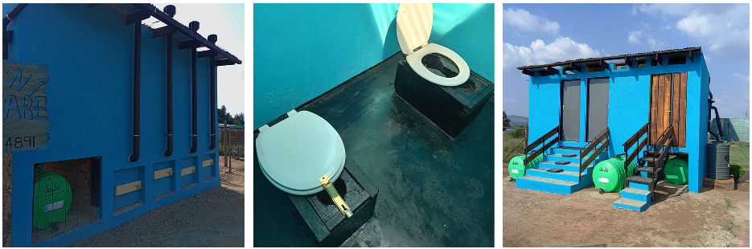

<!-- badges: start -->

<!-- badges: end -->

<h1> Sitting Interface for Urine Diverting Dry Toilet </h1>

<b>Contributors</b>  
- Teymour D'Andrea
</a> *author*  
- Jakub Tkaczuk <a href="https://orcid.org/0000-0001-7997-9423">
 0000-0001-7997-9423
</a> *supervisor, developer, maintainer*  
- Elizabeth Tilley <a href="https://orcid.org/0000-0002-2095-9724">
 0000-0002-2095-9724
</a> *supervisor*  

 

 

  
This repository compliments the openly-accessible master’s thesis, available on the   
<a href="">ETH Research Collection</a>.

# Background

This repository compliments the Master's thesis of Teymour D'Andrea's, who adapted an existing open-source user interface of a Urine Diverting Dry Toilet (UDDT), designed by [EOOS](https://urinetrap.com/). The thesis proposes modifications to the design with an aim of making it more suitable for the South Africa’s context (i.e., sitting instead of squatting) and accessible to users of all age.

This repository contains mechanical drawings (both 3D and 2D) of modified steel molds, based on the original open-source concept to cast concrete user interfaces. These interfaces were tested for urine collection efficiency, yielding satisfactory results. Further optimization of the steel mold design is suggested to facilitate easier extraction.

# Repository Structure

`cad` directory contains the CAD assemblies for the steel molds of the user interfaces (for adults and children) and the designs for the concrete seats. All files are provided in `.stl` and `.stp` formats.

`drawings` directory contains 2D drawings for all relevant parts of which the steel molds and the concrete seats are composed of.

# Design

## Steel mold

The origin for this work is the open-source UDDT design by [EOOS](https://urinetrap.com/).

One sitting UDDT design is proposed for adult users:

and one for children users:

Each of these drawings is supplemented by six additional technical drawings, detailing the geometry of parts used in the steel mold construction:

- `drawings/EOOS_adult_tech_1.pdf` and `drawings/EOOS_child_tech_1.pdf`
- `drawings/EOOS_adult_tech_2.pdf` and `drawings/EOOS_child_tech_2.pdf`
- `drawings/EOOS_adult_tech_3.pdf` and `drawings/EOOS_child_tech_3.pdf`
- `drawings/EOOS_adult_tech_4.pdf` and `drawings/EOOS_child_tech_4.pdf`
- `drawings/EOOS_adult_tech_5.pdf` and `drawings/EOOS_child_tech_5.pdf`
- `drawings/EOOS_adult_tech_6.pdf` and `drawings/EOOS_child_tech_6.pdf`

Names of these drawings refer to the numbers shown on the exploded view of a complete steel mold, allowing for easy part identification:

## Seat

The UDDT part fits into a concrete seat, which was also designed and built:

The dimensions for both adult and children versions are available in `drawings/tech_seat_adult.pdf` and `drawings/tech_seat_child.pdf`.

## Draft Angle for Demolding

A draft angle of 3 degrees on all walls is suggested to facilitate concrete demolding process.

## Urine Diversion Performance

The performance of sitting UDDT interfaces for urine diversion was evaluated with the urinator (open-source tool for this purpose, proposed by [EOOS](https://urinetrap.com/)). The results are presented below:

|            | Male Urethra        |          | Female Urethra      |          |
|------------|---------------------|----------|---------------------|----------|
|            | Avg. efficiency [%] | Std. Dev.| Avg. efficiency [%] | Std. Dev.|
| Adult 1    | 83.5                | 6.0      | 81.0                | 6.5      |
| Adult 2    | 81.8                | 4.7      | 81.3                | 7.8      |
| Children 1 | 88.7                | 4.0      | 85.0                | 5.6      |
| Children 2 | 88.7                | 4.3      | 84.7                | 4.0      |

The results above show that the interface was able to prevent between 81% and 88% of liquid from entering the feces compartment of the UDDT toilet, calculated as a diverted volume of liquid per total volume of liquid, which passed through the urinator.

## Toilet Block Construction

Above designs were constructed and integrated into new toilet blocks for Konanani Crèche at the outskirts of Pretoria, South Africa.

# License

The complete design is licensed under [Creative Commons Attribution 4.0 International](https://github.com/Global-Health-Engineering/sitting-UDDT/blob/main/LICENSE.md).
